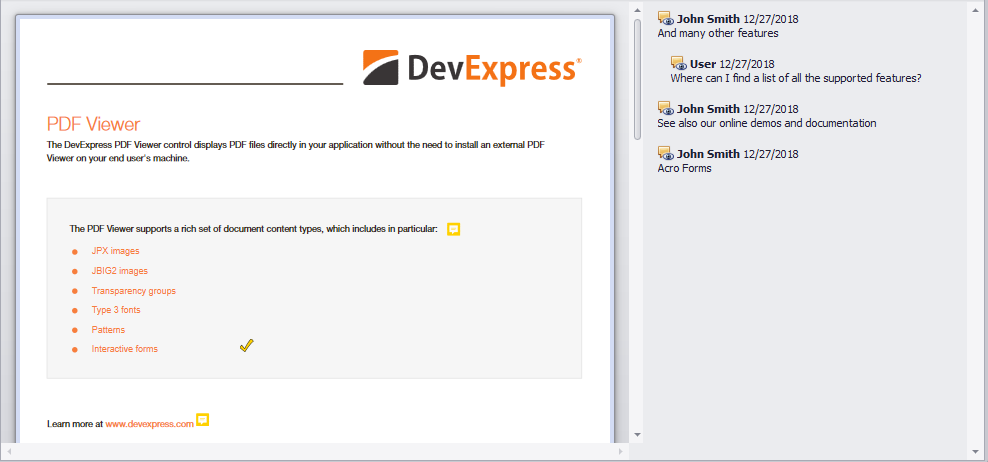

<!-- default badges list -->

<!-- default badges end -->
# How to read and display comments from a PDF file

**This example is obsolete. Starting with version 20.2, the DevExpress PDF Document API and PDF Viewer support sticky notes (comments) out of the box. PDF Viewer has the Comments Pane to add, edit and remove sticky notes in UI. Please refer to this blog to learn more: [PDF – Sticky Notes and Comments](https://community.devexpress.com/blogs/office/archive/2020/11/17/pdf-sticky-notes-and-comments.aspx)**

This example demonstrates how to read comments ([sticky notes](https://documentation.devexpress.com/OfficeFileAPI/DevExpress.Pdf.PdfTextAnnotation.class)) from a PDF document with help of the [PDF Document API](https://docs.devexpress.com/OfficeFileAPI/16491/pdf-document-api) library. Retrieved comments' data is displayed in an [AccordionControl](https://docs.devexpress.com/WindowsForms/114553/controls-and-libraries/navigation-controls/accordion-control) next to the PDF document loaded into [PDF Viewer](https://www.devexpress.com/products/net/controls/winforms/pdf-viewer/).

